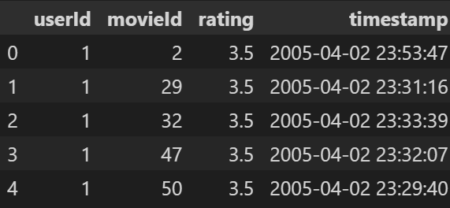
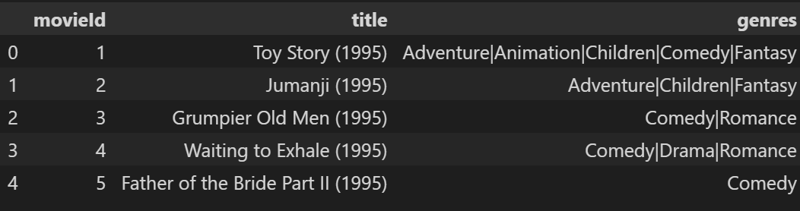
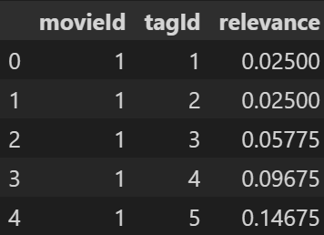

# #数据

[MovieLens 20M Dataset | Kaggle](https://www.kaggle.com/datasets/grouplens/movielens-20m-dataset?datasetId=339)数据集描述了电影推荐服务 MovieLens 的评级和文本标记。它包含 27278 部电影的 20000263 个评级和 465564 个标签。这些数据由1995年1月9日至2015年3月31日期间的138493名用户创建。该数据集生成于2016年10月17日。

- ratings.csv, 包含userId对于movieId的评分

- movie.csv, 包含movieId对应的体裁（genres）信息
  
  

- genome_scores.csv, 包含movidId对应的tag以及相应的相关性
  
  

# 实验

- [DSSM_feature_column](./DSSM_feature_column.ipynb)使用双塔模型进行评分估计，对于数据使用tf.feature_column进行处理

- [DSSM_keras_preprocess](./DSSM_keras_preprocess.ipynb)使用双塔模型进行评分估计，对于数据使用tf.keras.layers(tf.keras.layers.preprocessing)进行处理

- [FM_keras_preprocess](./FM_keras_preprocess.ipynb)使用DeepFM模型进行评分估计，对于数据使用tf.keras.layers(tf.keras.layers.preprocessing)进行处理

# 说明

[tf1_vs_tf2 migrate](https://www.tensorflow.org/guide/migrate/tf1_vs_tf2?hl=zh-cn#%E5%90%8C%E5%BD%A2%E5%BC%82%E4%B9%89_api)，本仓库编写时主要参考该网址中tf1与tf2迁移的特点。除了对于模型构建的api的改变外，主要是tf.feature_colum的数据处理流迁移到tf.keras.layers.preprocessing。

ipynb中没有保存在完整数据集下训练的输出结果信息，但模型能够在数据集的小子集下跑通训练代码，且能执行推理代码(model.predict)

